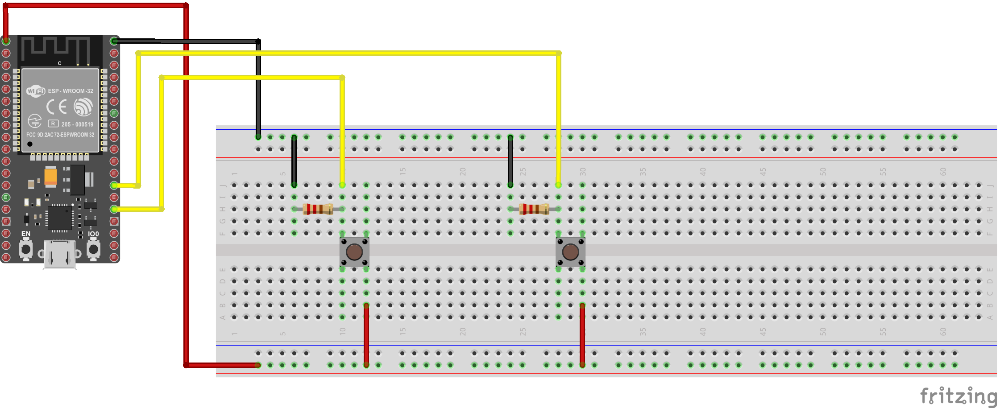
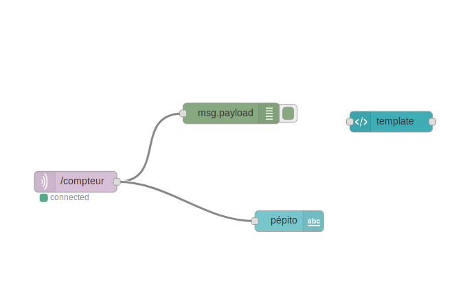

# liste-de-course

Compteur pour liste de course (ajout et suppression de produits) via l'interface Node Red par ESP32

# Videos

# Schema montage

# Node-red

# liste composant

+ 2 bouton push
+ 1 ESP 32
+ 2 resistances (aleatoire)
+ 4 cables male/male
+ 4 cables male/femelle
+ 1 cable micro USB
+ 1 breadboard

